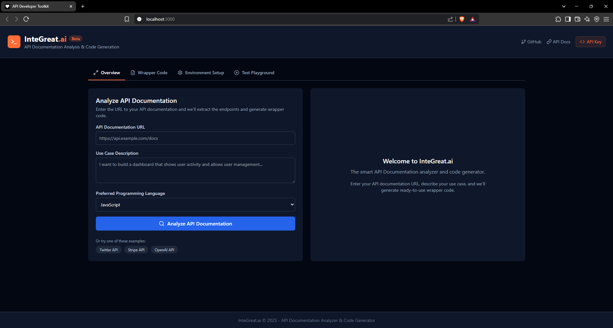
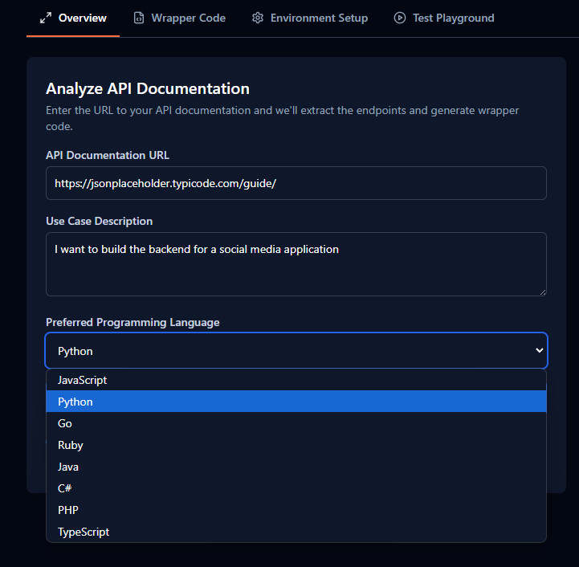
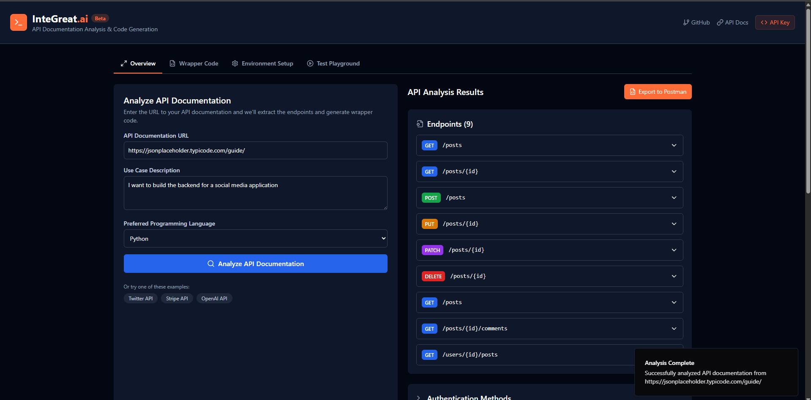
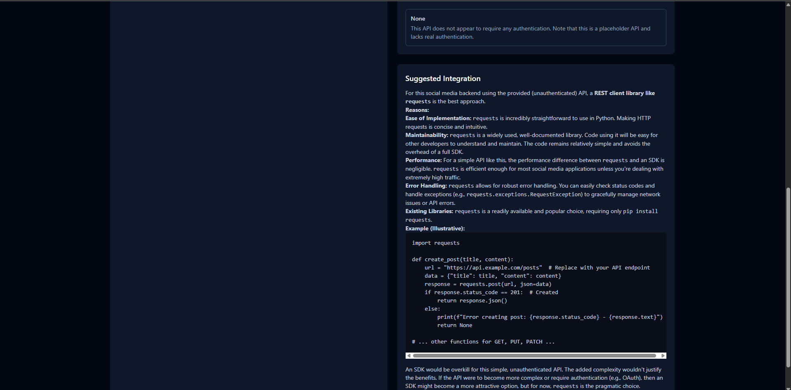
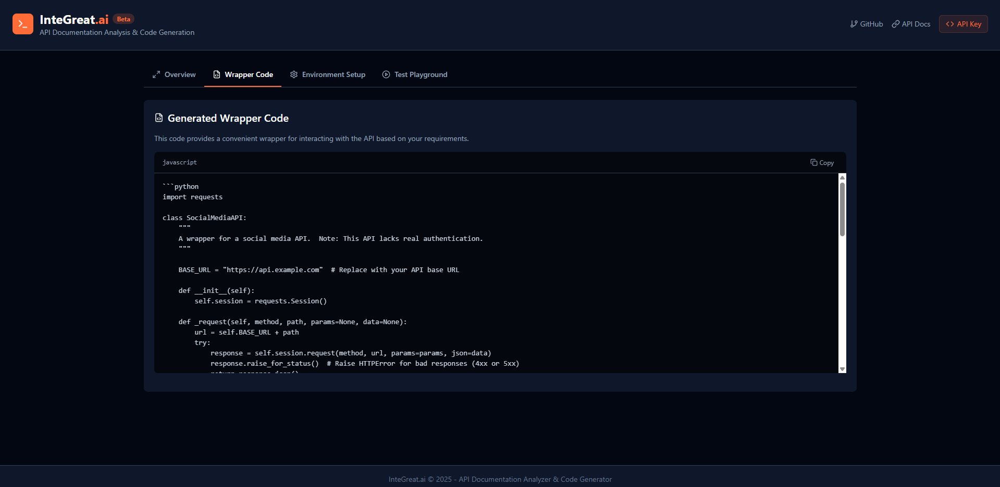
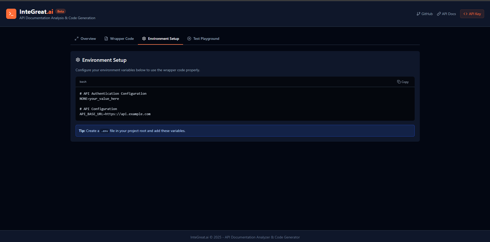
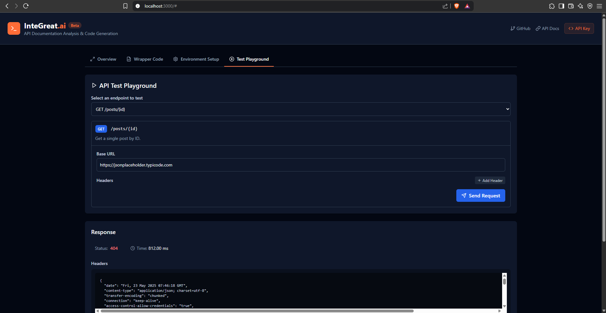
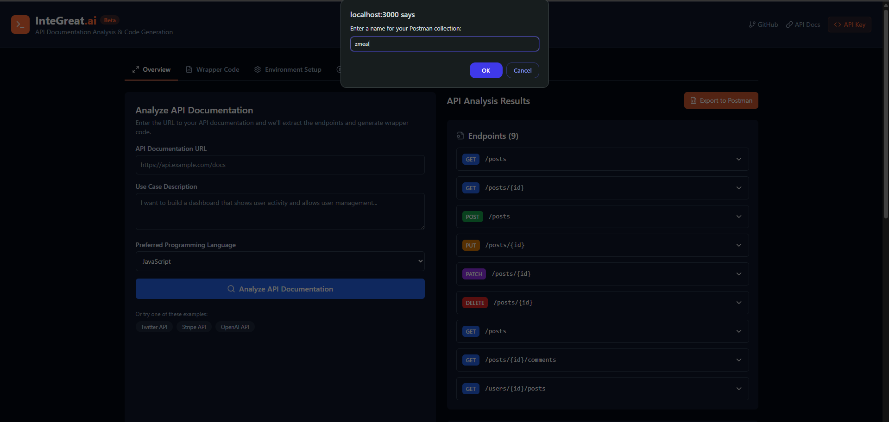
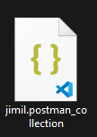
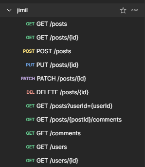

# 🚀 InteGreat.ai


**InteGreat.ai** is a comprehensive tool for analyzing API documentation, generating wrapper code, and testing API endpoints. It helps developers integrate with third-party APIs more efficiently by automating documentation analysis and generating ready-to-use code.



---

## ✨ Features

- 📚 **API Documentation Analysis**  
  Upload or link to API documentation and get it automatically parsed.
  
  
  

- 💻 **Wrapper Code Generation**  
  Generate ready-to-use code in your preferred programming language.
  

- 🔑 **Environment Setup Templates**  
  Automatically generate `.env` templates based on the API's authentication.
  

- 🧪 **API Testing Playground**  
  Test API endpoints directly within the application.
  

- 📤 **Postman Collection Export**  
  Export the analyzed API as a Postman collection.
  
  
  

---

## 🛠️ Tech Stack

### 🔷 Frontend
- React 18
- TypeScript
- Vite
- Tailwind CSS
- `shadcn/ui` components
- `lucide-react` icons

### 🐍 Backend
- Python
- FastAPI
- Uvicorn (ASGI server)
- Google Generative AI (Gemini API)

---


---

## 🚀 Setup Instructions

### 🔧 Backend Setup

```bash
# Navigate to the backend directory
cd backend

# Create virtual environment
python -m venv venv

# Activate environment
# On Windows:
venv\Scripts\activate
# On macOS/Linux:
source venv/bin/activate

# Install dependencies
pip install -r requirements.txt

# Create a .env file with:
# GEMINI_API_KEY=your_gemini_api_key_here

# Start server
uvicorn main:app --reload

# Navigate to the frontend directory
cd frontend

# Install dependencies
npm install

# Start the development server
npm run dev

Visit http://localhost:3000 to view the application.

🔐 Environment Variables
Create a .env file in the backend/ directory:

ini
Copy
Edit
GEMINI_API_KEY=your_google_gemini_api_key
Additional variables may be required based on target API authentication.

📋 Usage Guide
Open the app in your browser at http://localhost:3000

Enter the API documentation URL

Describe your use case

Select your programming language

Click Analyze API

After analysis:
✅ View endpoints & auth methods

🧩 Generate wrapper code

🧪 Test endpoints in the playground

📤 Export to Postman

🧱 Building for Production
Frontend
bash
Copy
Edit
npm run build
Output will be in frontend/dist.

Backend (Production)
Use Gunicorn with Uvicorn workers:

bash
Copy
Edit
gunicorn -k uvicorn.workers.UvicornWorker main:app
🤝 Contributing
Contributions are welcome! Feel free to fork the repo and submit a pull request. Let's make API integration easier for everyone.

📄 License
Licensed under the MIT License.

yaml
Copy
Edit

---
